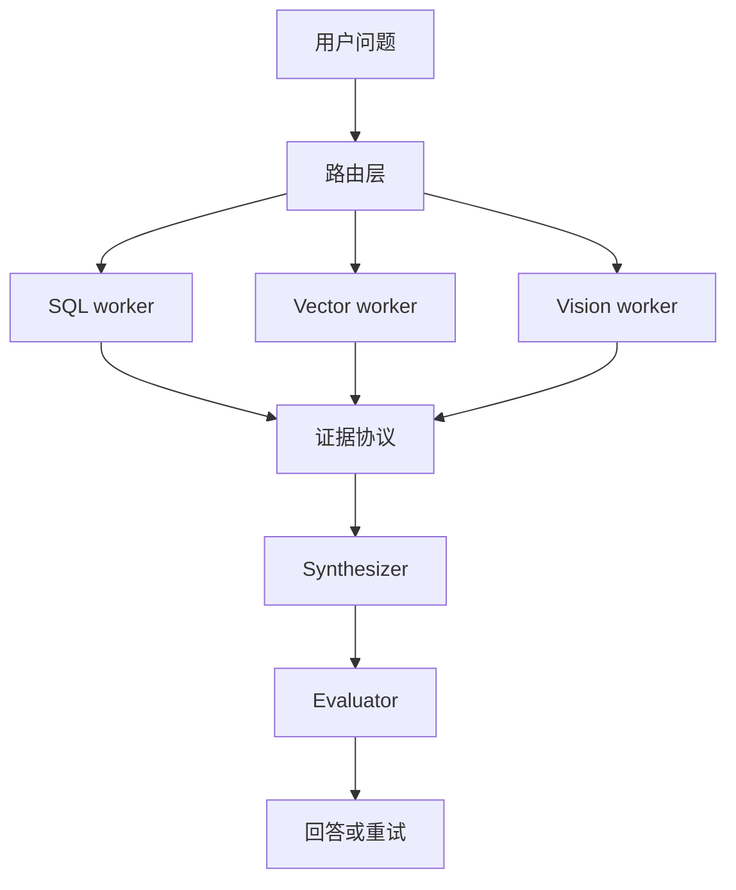

> RAG 的难点正在从“能不能检索到内容”，转向“能不能在多源、多模态、多跳推理里主动修错”。

传统 RAG 的链路很清楚：用户提问，系统检索，模型生成答案。

这个链路适合简单问答。

但真实业务问题往往不这么简单。

用户可能同时需要查结构化数据、看文档、理解图片、比较历史记录，还要在某一步失败后继续恢复。

这时，一个单体 RAG 很容易变成“大而全”的脆弱系统。

## 分层比全能更可靠

分层 Agentic RAG 的核心思路，是不要让一个 Agent 同时承担所有任务。

更稳的拆法是：

- 路由层：判断问题需要哪些数据源；
- SQL worker：处理结构化查询；
- Vector worker：处理语义检索；
- Vision worker：处理图像或文档截图；
- Synthesizer：汇总证据并生成最终回答；
- Evaluator：检查证据是否足够、是否需要重试。

这不是为了追求架构复杂，而是为了让每一层都能被单独评估和修复。



## 错误恢复比一次成功更重要

复杂 RAG 最常见的问题，不是完全检索不到，而是“检索到一半”。

比如 SQL 找到了高流失客户，但向量检索漏掉了关键投诉；或者模型生成了三表 join，但 join 条件不对。

如果系统没有错误恢复，它会基于残缺证据生成一个很自信的答案。

更好的设计是让失败变成信号：

- SQL 执行失败，返回错误和 schema 差异；
- 检索证据不足，触发查询改写；
- 多源结论冲突，要求补充证据；
- 多跳链路太长，拆成多个子问题。

Google Research 对多 Agent 系统的评估也能给这里一个提醒：任务可并行时，多 Agent 可能更有效；任务强顺序时，独立 Agent 可能放大错误。分层 Agentic RAG 不能只追求 worker 数量，而要把路由、证据和恢复边界设计清楚。

## 多模态不是加一个模型那么简单

多模态 RAG 的风险在于，把图片、表格、截图都塞进一个上下文窗口。

工程上更好的方式，是把多模态输入先结构化。

例如把图表提取为指标，把截图识别为界面状态，把 PDF 表格转成可查询数据，再交给上层推理。

模型应该处理语义整合，而不是替所有数据工程步骤背锅。

## 先给结论

Agentic RAG 的价值不在“RAG 也用 Agent”这个标签。

它真正解决的是复杂问题里的分工、纠错和证据闭环。

当问题跨越 SQL、向量、文档和图片时，系统需要的不再是一个更大的 Prompt，而是一套分层、可观测、可恢复的检索推理架构。

参考资料：

- https://research.google/blog/towards-a-science-of-scaling-agent-systems-when-and-why-agent-systems-work/
- https://www.infoq.com/articles/building-hierarchical-agentic-rag-systems/

## 一个真实查询为什么会击穿普通 RAG

想象一个客服运营问题：

> 最近华东区企业客户续费下降，主要原因是什么？有没有和新版本功能变更有关？

这个问题不是一次向量检索能解决的。

它至少需要四类信息：

- CRM 里的客户续费数据；
- 工单系统里的投诉和反馈；
- 产品版本记录；
- 可能还有销售会议纪要或截图。

普通 RAG 会先检索一些文档，再让模型总结。

但它很可能漏掉结构化数据，也可能忽略时间窗口，还可能把个别投诉当成主要原因。

分层 Agentic RAG 的意义，是让系统先拆问题，再按数据类型找证据。

## 分层系统的关键是证据协议

多 worker 协作时，最容易乱的是证据格式。

SQL worker 返回表格，Vector worker 返回文档片段，Vision worker 返回图片理解结果。如果这些证据没有统一结构，Synthesizer 就会被迫在混乱上下文里“凭感觉整合”。

更稳的做法是定义统一证据协议：

```json
{
  "source": "support_ticket",
  "time_range": "2026-03",
  "claim": "华东区投诉集中在权限配置",
  "evidence": ["ticket-123", "ticket-456"],
  "confidence": "medium"
}
```

模型最终回答时，不是直接引用一堆碎片，而是基于结构化证据做综合判断。

## 自主错误恢复要有限度

Agentic RAG 不是让系统无限重试。

每次重试都要有原因。

比如：

- SQL schema 不匹配，重写查询；
- 检索结果证据不足，扩展关键词；
- 多源证据冲突，请求人工确认；
- 超过最大跳数，降级输出当前证据和不确定项。

没有边界的自恢复，会变成不可控循环。

## 评估也要分层

分层 Agentic RAG 不能只评估最终回答。

因为最终回答错了，原因可能来自路由、SQL、向量检索、视觉解析、证据整合或生成。

如果只看最终结果，团队很难知道该修哪一层。

更好的评估方式是：

- 路由层：是否选对数据源；
- SQL worker：查询是否正确；
- Vector worker：证据召回是否充分；
- Vision worker：图表和截图是否结构化正确；
- Synthesizer：是否只基于证据生成；
- Evaluator：是否能识别证据不足和冲突。

这样每一层都能被单独优化。

## 什么时候不需要 Agentic RAG

不是所有 RAG 都要变复杂。

如果问题稳定、数据源单一、文档质量高、答案不需要多跳推理，普通 RAG 仍然更划算。

Agentic RAG 适合的是复杂问题：多数据源、多模态、多步骤、需要纠错和证据追踪。

如果团队只是想做一个 FAQ 问答系统，上来就引入多 Agent 分层，反而会增加维护成本。

架构的复杂度应该由问题复杂度驱动，而不是由技术热度驱动。

## 最后：RAG 会走向证据驱动推理系统

RAG 正在从“检索增强生成”，走向“证据驱动推理系统”。

分层、专业 worker、证据协议、错误恢复和分层评估，都是为了让复杂问题不再依赖一次性大 Prompt。

真正成熟的 RAG，不只是能找资料，而是能说明答案基于哪些证据、哪些证据不足、下一步该如何补证。
