cover: "/images/posts/å-å-å-ªç-Markdown-äº-ï¼-AI-Bot-ç-MDX-æµ-å¼-æ-²æ_001.jpg"


> AI Bot 的下一步，不只是把回答写得更像文章，而是把回答变成可交互的界面。Markdown 负责表达内容，MDX 负责把内容变成组件。

很多 AI 产品的回答界面，今天还停留在“流式输出一段 Markdown”。

这已经够用了，但也越来越不够用了。

当用户问的是“帮我分析项目进度”“帮我比较三套方案”“帮我执行一次排查流程”时，纯文本天然有三个限制：

- 状态看不清，只能靠段落描述；
- 操作接不上，按钮、表格、图表还要跳到别的页面；
- 过程不可控，用户不知道 Agent 正在哪一步、卡在哪里、需要自己确认什么。

所以我更愿意把 MDX 流式渲染理解为：**让 AI 回答从文档形态，升级为工作台形态。**

## Markdown 解决表达，MDX 解决执行感

Markdown 的优势是稳定、简单、跨平台。它适合写说明、总结、列表、代码块。

但 MDX 多了一层能力：它允许在文本中嵌入组件。

对 AI Bot 来说，这个差异很关键。

一段回答可以继续是自然语言，但当模型识别出“这里需要展示状态”“这里需要比较方案”“这里需要用户选择”时，前端可以把结构化事件渲染成对应组件：

```tsx
// 核心不是让模型直接写任意 JSX，而是让模型输出受控组件名和参数
const componentMap = {
  AgentStatusGrid,
  HandoffTimeline,
  McpToolTrace,
};

renderBlock({ type: "AgentStatusGrid", props: safeProps });
```

这不是把 Bot 做得更花哨，而是把信息层级做清楚。

## 流式渲染的关键不是“流”，而是边输出边结构化

传统流式输出只关心 token 一段段出现。

MDX 流式渲染更关心：在输出过程中，哪些片段是文本，哪些片段是组件，哪些片段需要等工具调用结果回来再渲染。

一个更稳的链路应该是：

```mermaid
flowchart LR
  A["LLM 输出"] --> B["增量解析"]
  B --> C["白名单组件"]
  C --> D["参数校验"]
  D --> E["前端渲染"]
```



这里最重要的不是让模型自由发挥，而是让模型只能在安全边界里表达 UI 意图。

## 不要裸跑 MDX

MDX 的风险也很直接：如果让模型直接生成可执行组件，等于把 UI 权限交给了不可信输入。

生产里更推荐三条线：

- 组件白名单：模型只能选择预置组件；
- 参数 schema：所有 props 先校验再渲染；
- 降级策略：解析失败时回退为普通 Markdown。

这也是我不建议一开始就追求“万能组件”的原因。

先做三个高频组件就够了：状态面板、工具调用轨迹、人工接管确认。

## 最小落地路径

第一阶段，保留 Markdown 流式输出，只在服务端额外产出结构化事件。

第二阶段，把少数事件映射到固定组件，例如任务状态、工具返回、审批确认。

第三阶段，再考虑更复杂的 MDX 片段、图表组件和前端沙箱。

技术栈可以从 AI SDK 的 `streamUI` / `createStreamableUI` 思路开始，但不要把重点放在框架炫技上。真正要设计的是组件协议：哪些组件能被调用、参数是什么、失败后怎么退回。

AI SDK 文档里其实已经把两条路线分开了：RSC 的 `streamUI` 可以从服务端向客户端流式传 React 组件，但官方也提示 RSC 仍偏实验，生产场景更推荐 AI SDK UI。`createUIMessageStream` 则更像一条稳定消息流，支持消息合并、错误处理和 finish callback，更适合做受控的组件事件流。

## 先给结论

AI Bot 不应该永远停留在“会写一篇回答”。

当它开始连接工具、执行任务、交付结果时，纯 Markdown 会越来越像一个窄入口。

MDX 流式渲染的价值不是炫酷，而是让 AI 的过程、状态和结果都能被用户看见、检查和接管。

参考资料：

- https://ai-sdk.dev/docs/ai-sdk-rsc/streaming-react-components
- https://ai-sdk.dev/docs/reference/ai-sdk-ui/create-ui-message-stream

## 一个更真实的产品场景

假设你正在做一个面向研发团队的 AI Bot。用户问它：

> 帮我看一下这个版本为什么还不能发。

纯 Markdown 的回答可能是这样的：

- 有 3 个失败测试；
- 有 2 个高风险文件改动；
- 有 1 个接口没有通过回归；
- 建议先修测试，再检查权限逻辑。

这当然能读。

但如果换成 MDX 流式渲染，回答可以在同一个界面里逐步长出来：

1. 先出现一段文字解释当前分析阶段；
2. 然后出现 `<ReleaseRiskPanel />`，展示风险等级；
3. 测试跑完后，追加 `<FailedTestList />`；
4. 需要人工确认时，出现 `<ApprovalActions />`；
5. 最后给出可复制的 release checklist。

这时候用户看到的就不再是一篇“报告”，而是一个可以操作的分析面板。

这就是 MDX 对 AI Bot 的意义：**它把回答从静态内容，变成可交互交付物。**

## 技术上真正要分清三层

第一层是模型输出层。

模型不应该输出任意 JSX，更不应该直接输出可执行代码。它应该输出受控的结构化事件，例如：

```json
{
  "type": "component",
  "name": "ReleaseRiskPanel",
  "props": {
    "risk": "high",
    "failedTests": 3
  }
}
```

第二层是服务端校验层。

服务端负责判断这个组件能不能渲染、参数是否合法、是否包含敏感数据。任何不在白名单内的组件，都应该被降级成普通文本。

这也是为什么我更推荐“模型输出组件事件”，而不是“模型直接输出 MDX 源码”。事件流可以被 schema 校验、被审计、被降级；源码一旦进入执行路径，安全边界就会变得模糊。

第三层是前端渲染层。

前端只接收已经校验过的组件事件，然后用稳定组件库渲染。这样用户看到的是“AI 生成的界面”，但真正运行的是你预先定义好的组件。

```mermaid
flowchart LR
    A["模型输出结构化事件"] --> B["服务端校验和白名单"]
    B --> C["组件事件流"]
    C --> D["前端稳定组件库"]
    D --> E["可交互结果"]
    B --> F["非法组件降级为文本"]
```



## 最容易踩的坑

第一个坑，是把 MDX 当成“让模型写前端代码”。

这会把安全边界打穿。

第二个坑，是一开始就追求万能组件。

真实项目里，先做 3 到 5 个高频组件更稳：状态卡片、进度时间线、工具调用轨迹、审批按钮、结果表格。

第三个坑，是忽略流式状态。

组件不是一次性全部出现。它们会随着工具调用、任务执行、结果返回逐步补齐。所以每个组件都要有 loading、partial、failed、done 四类状态。

## 最后：Markdown 写回答，MDX 交付界面

Markdown 让 AI 会写回答，MDX 让 AI 会交付界面。

这个判断背后不是前端框架之争，而是产品形态变化。

当 AI Bot 只负责解释问题，Markdown 足够好；当它开始执行任务、展示状态、等待审批、返回结构化结果时，单纯文字就会变成瓶颈。

MDX 流式渲染真正要解决的，是让用户在同一个界面里看见过程、理解风险、接管关键动作。

这也是 AI Bot 从聊天工具走向工作台的关键一步。
