---

layout: post
title: "用 DSPy 构建 Agent Skill：从手工 Prompt 到可编译技能"
categories: [AI, 技术]
description: "Skill 不应该只是一段写得很长的 Prompt。真正可复用的 Skill，应该能被评测、被优化、被迁移。"
keywords: 用,DSPy,构建,Agent,Skill从æ‹å·¥,Prompt,å°å¯ç–译æŠèƒ½
mermaid: true
sequence: false
flow: false
mathjax: false
mindmap: false
mindmap2: false
cover: "/images/posts/post_skill-first-principles-underrated-prompt-engineering_001.jpg"
---


> Skill 不应该只是一段写得很长的 Prompt。真正可复用的 Skill，应该能被评测、被优化、被迁移。

很多 Agent 项目做到后面，都会遇到同一个问题：Skill 越写越像一堆 SOP。

一开始只是几条规则。

后来加上边界条件、异常处理、字段说明、工具调用顺序、反例提醒。再后来，整个 `SKILL.md` 变成一份很长的“写给模型看的操作手册”。

问题在于：**手册越长，不代表执行越稳。**

模型可能读漏规则，可能在复杂计算上犯错，也可能换一个模型后表现完全变样。

DSPy 给了另一个角度：把 Skill 从“手写 Prompt”，改造成“可声明、可编译、可回归”的 LLM 程序。

DSPy 官方把自己的定位说得很直白：Programming, not prompting。它强调用结构化代码构建模块化 AI 软件，而不是维护脆弱的字符串 Prompt。这和 Skill 工程化的方向高度一致：把经验从文档里抽出来，变成可测试、可组合的程序结构。

## Skill 的本质是结构化调用链

一个 Skill 通常包含三类东西：

- 输入：用户意图、上下文、业务数据；
- 判断：哪些情况走规则，哪些情况交给模型；
- 输出：结论、动作参数、工具调用结果。

这正好对应 DSPy 的 Signature 和 Module。

```python
import dspy

class AttendanceDecision(dspy.Signature):
    """判断考勤异常应该走哪类处理动作。"""

    rule_context: str = dspy.InputField()
    raw_record: str = dspy.InputField()
    decision: str = dspy.OutputField()
    reason: str = dspy.OutputField()
```

这段代码的价值不是少写 Prompt，而是把输入输出边界固定下来。

边界固定后，后面才谈得上测试、优化和迁移。

## 复杂计算不要交给模型猜

很多 Skill 最容易翻车的地方，不是语言理解，而是确定性计算。

比如考勤场景里，扣除午休、跨天时长、异常阈值，这些都应该由 Python 做。

模型只负责模糊判断：这条记录像调休、外勤、漏打卡，还是需要人工确认。

```python
class AttendanceSkill(dspy.Module):
    def __init__(self):
        self.decide = dspy.ChainOfThought(AttendanceDecision)

    def forward(self, record):
        duration = calculate_work_duration(record)  # 确定性规则用代码
        return self.decide(
            rule_context=f"实际工作时长：{duration}",
            raw_record=str(record),
        )
```

这就是 Skill 工程化的第一条原则：**能用代码稳定解决的，不要交给 Prompt 赌概率。**

## Compile 的意义是让经验可回归

手工 Prompt 最大的问题，是优化过程不可复现。

你今天改了一句话，效果变好还是变坏，往往靠感觉。

DSPy 的 Compile 思路是：准备少量标注样本和评估指标，让优化器寻找更合适的提示、示例和调用组合。

这不等于完全自动化，也不等于不需要人。

它的价值在于，把“我觉得这个 Prompt 更好”变成“这组样本上它确实更稳”。

## 什么场景适合 DSPy 化

不是所有 Skill 都值得上 DSPy。

适合的场景有三个特征：

- 子任务稳定：输入输出形态不会天天变；
- 有评估样本：哪怕只有几十条，也能说明什么叫对；
- 质量很重要：错误会带来返工、误操作或信任损耗。

不适合的场景也很明确：需求还在剧烈变化、没有样本、只是一次性任务。

## 先给结论

Skill 的终局不应该是越写越长的 Prompt。

更合理的方向，是把 Skill 拆成三层：

- 固定规则用代码；
- 模糊判断用模型；
- 优化过程用评估集闭环。

DSPy 的价值就在这里：它让 Skill 从“经验文档”，变成一段可以被编译和回归的 AI 程序。

参考资料：

- https://dspy.ai/
- https://dspy.ai/learn/programming/signatures

## 一个更完整的改造路径

如果把一个真实 Skill 从 `SKILL.md` 改造成 DSPy Module，我不会一步到位。

```mermaid
flowchart LR
    A["选择稳定子任务"] --> B["整理标注样本"]
    B --> C["定义评估指标"]
    C --> D["编写 DSPy Module"]
    D --> E["Compile 优化"]
    E --> F["回归验证"]
```



第一步，只抽出最稳定的子任务。

比如“判断考勤异常类型”比“完整处理考勤流程”更适合作为第一版。因为它输入清楚，输出也清楚。

第二步，写 20 到 50 条小样本。

样本不用一开始追求大而全，但要覆盖常见边界：漏打卡、外勤、请假、跨午休、跨天、记录冲突、需要人工确认。

第三步，把评估指标写出来。

不要只看模型回答顺不顺。更好的指标是：

- 决策类型是否正确；
- 是否错误自动处理高风险记录；
- 是否把需要人工确认的记录留给人；
- 输出字段是否符合工具调用格式。

第四步，再用 DSPy compile 去优化提示和示例组合。

这样做的好处是，每次换模型、换数据、换流程，都可以重新跑一遍评估，而不是靠人肉感觉调 Prompt。

## Skill 工程化的真正收益

很多人会问：我直接写好 Prompt 不也能用吗？

能用。

但问题在长期维护。

当一个 Skill 被团队长期使用，它会不断遇到新边界：

- 新政策；
- 新字段；
- 新系统；
- 新模型；
- 新异常样本。

手工 Prompt 的维护方式，是不断往文档里补规则。补到最后，模型读起来越来越重，人也越来越难判断哪条规则影响了效果。

DSPy 的方式，是把规则、样本、指标和模块拆开。

这会让 Skill 从“经验堆叠”变成“可测试程序”。

Signature 的官方定义也能说明这一点：它声明的是模块的输入/输出行为，而不是规定“应该怎样问模型”。字段名、类型和语义角色会进入程序边界，后续模块组合、compile 和回归评估都建立在这个边界上。

## 不是所有 Prompt 都应该 DSPy 化

这里要克制。

如果一个 Skill 只是一次性写作、临时资料整理、简单风格转换，用 DSPy 可能是过度工程。

DSPy 更适合三类任务：

- 高频重复；
- 结果可判定；
- 错误成本较高。

比如审批判断、字段抽取、分类路由、异常识别、工具参数生成，都比开放式创意写作更适合。

## 引入 DSPy 前先准备评估样本

很多团队一听 DSPy，就先研究 API。

但真正的起点不是 API，而是样本。

没有样本，就没有评估；没有评估，compile 也只是换一种方式调 Prompt。

所以第一步应该从失败记录里整理样本。

比如一个考勤 Skill，可以收集：

- 正常打卡；
- 漏打卡；
- 外勤；
- 请假；
- 跨午休；
- 跨天；
- 记录冲突；
- 必须人工确认的边界。

每条样本都要有期望输出和理由。

这样 DSPy 才能围绕真实业务优化，而不是围绕抽象 Prompt 优化。

## DSPy 化后的 Skill 更像小型软件模块

一旦 Skill 进入 DSPy，它就不再只是文档。

它会有输入输出、确定性函数、模型调用、评估集、优化过程和回归测试。

这意味着维护方式也要改变。

你需要像维护代码一样维护它：样本变了要更新评估，业务规则变了要更新模块，模型升级后要重新跑回归，输出格式变了要调整调用方。

这听起来更重，但对于高频、高风险 Skill 来说，这是必要成本。

否则 Skill 越用越久，越不知道它到底为什么有效。

## 最后：别把 Skill 写成越来越长的 Prompt

别再把 Skill 写成一份越来越长的 Prompt。

应该把它变成可评估、可编译、可迁移的模块。

DSPy 的价值不在于替你省掉所有提示词，而在于把提示词、规则、样本和评估放进一个可回归的工程闭环里。
