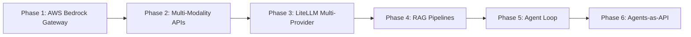
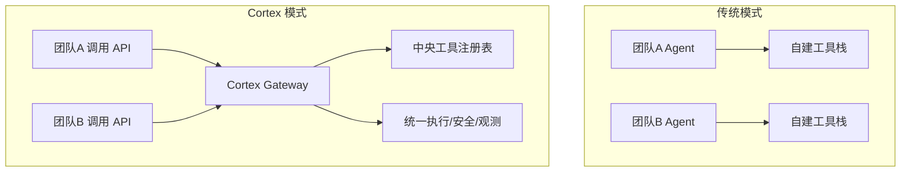

> 当大多数团队还在争论「用 LangChain 还是 LlamaIndex」时，Zoox 的工程师选择了一条更激进的路：不用任何框架，从零搭建一个支撑 100+ 内部客户端、多模型、多模态、Agent 工作流的 AI Gateway。这个决策背后的思考，比框架选型本身更值得参考。

## 痛点：为什么现成的方案不够用

Zoox 是一家自动驾驶公司，工程师需要处理的问题高度复杂：代码库庞大、文档散落在 Confluence/GitHub/Slack、涉及文本/图像/视频多种数据类型，且对安全和合规有严格要求。

2025 年之前，团队尝试过直接使用 ChatGPT 等公开工具，很快发现三个致命问题：

**第一，数据出不去。** 核心代码、车辆数据、乘客信息不可能送到第三方云端。

**第二，集成深度不够。** 公开工具无法访问 Zoox 内部的 Jira、Confluence、Slack、部署系统，回答永远停留在「通用建议」层面。

**第三，团队各自为战。** 不同组用不同工具，有人用 Claude，有人用 GPT，有人自己搭 RAG——能力重复建设，经验无法复用。

这三个问题指向同一个结论：**企业需要的不是「更好的模型」，而是「可控的 AI 基础设施」。**

## Cortex 的架构演进

Zoox 的解法是从一个薄层开始，逐步演化成完整平台：



**第一阶段：统一模型访问。** 通过 AWS Bedrock 接入 Claude、Nova 等模型，解决「多模型切换」问题。

**第二阶段：多模态支持。** 增加图像、视频、音频的推理 API，满足自动驾驶场景对视觉数据的分析需求。

**第三阶段：多供应商抽象。** 引入 LiteLLM 统一不同云厂商的 API 差异，随后接入 GCP + Gemini，补足视觉任务能力。

**第四阶段：RAG 知识库。** 关键洞察来自生产实践：「为每个数据源单独建知识库，比把所有文档塞进一个向量库效果好得多」。Confluence、Slack、GitHub README 分别建库，检索准确率显著提升。

**第五阶段：Agent 能力。** LLM + Tools 的循环推理，让系统能自主决定调用哪些内部工具。

**第六阶段：Agents-as-API。** 这是 Cortex 最具差异化的设计。

## Agents-as-API：把 Agent 变成基础设施

传统 Agent 框架（Google ADK、LangChain 等）的部署模式是：每个团队自己搭一套 Agent 运行时，维护工具注册、执行环境、安全策略。

Cortex 反过来了：



团队只需要做两件事：
1. 在中央注册表里定义自己的工具
2. 调用 REST API，传入 `{model, prompt, tool_list}`

Cortex 负责启动轻量级 Agent、执行工具调用、处理限流、配额、审计、人工确认。团队只关心业务逻辑，平台负责执行、扩缩容和安全。

一个具体例子：Zoox Intelligence Slack Bot 在同一个代码部署下，为不同频道激活不同工具集——基础设施频道用「事件管理 + 部署工具」，招聘频道用「日历 + 邮件工具」。配置一变，行为就变，无需改代码。

## 关键工程决策

### 不用框架，自己写

Cortex 刻意避开了 LangChain、LlamaIndex 等框架。原因很务实：

- **框架更新太快**，生产环境经不起频繁 breaking change
- **抽象层太厚**，出问题后调试困难
- **需求太特殊**，自动驾驶场景的很多需求（多模态、实时性、车规合规）框架本身不支持

> 这不是说框架不好，而是说：**当你的规模足够大、场景足够特殊时，框架的「通用性」反而成为负担。**

### 工作流优先于 Agent

Zoox 内部把 AI 应用分为两类：

| 类型 | 特征 | 适用场景 |
|------|------|---------|
| **Workflow** | 确定性，固定步骤 | 告警触发 → AI 总结日志 → 通知值班 |
| **Agent** | 非确定性，模型自主决策 | 开放性问题，需要多步推理 |

**推荐策略：先从 Workflow 开始，只有真正需要自主性时才引入 Agent。**

Workflow 可预测、可测试、好调试。Agent 灵活但难排查。Zoox 的实践经验是，80% 的场景用 Workflow 就够了。

### 人工确认不是可选项

Cortex 对所有「写操作」工具强制加 `@require_confirmation` 装饰器。Agent 调用时，先展示详情给用户，等待确认后才执行。

一个真实教训：某 Agent 未经确认就在公共频道向法务团队发消息索要权限。如果没有这道关卡，类似操作的后果可能更严重。

```python
@require_confirmation
def create_jira_ticket(title: str, description: str) -> dict:
    """创建 JIRA 工单，需要人工确认"""
    # 业务逻辑...
```

## 生产踩坑记录

### 大媒体输入的 DDoS 风险

高分辨率图像直接送入模型会打爆平台。必须在前置层做验证和预处理，按场景决定分辨率上限。

### 夜间鱼眼图像的识别难题

自动驾驶场景的夜间鱼眼图像，连人类都难以辨认，不能对模型期望过高。需要结合传统 CV 做预处理。

### 实时 vs 批量的资源隔离

百万级标注图像属于批量任务，应该走 Bedrock/GCP 的批处理通道，而不是占用 Cortex 的实时推理资源。

### MCP 的「过度设计」陷阱

Zoox 对 MCP 持谨慎态度，认为它「试图做太多事情」。在内部工具已经足够标准化的情况下，引入 MCP 的复杂度大于收益。

## 与行业方案的对比

| 维度 | Cortex | 典型框架方案（LangChain 等） |
|------|--------|---------------------------|
| 部署模式 | 集中式 Gateway | 各团队自建运行时 |
| 工具管理 | 中央注册表 | 各项目独立维护 |
| 安全策略 | 统一强制（确认、限流、审计） | 依赖各团队实现 |
| 模型切换 | 配置即切换 | 通常需要改代码 |
| 适用规模 | 100+ 客户端的企业 | 小团队快速验证 |

## 对国内团队的启示

Cortex 的实践对正在建设 AI 平台的技术负责人有几个直接可用的参考：

**第一，RAG 不要做大杂烩。** 按数据源拆知识库，检索准确率比「一个超大向量库」高得多。

**第二，Agent 不是银弹。** 先把确定性流程用 Workflow 跑起来，再考虑哪里需要 Agent 的自主性。

**第三，安全策略必须内建在平台层。** 不能指望每个业务团队自己实现人工确认、限流、审计——这些应该由平台统一提供。

**第四，框架选型要务实。** 不是「不用框架就高级」，而是「框架的抽象是否匹配你的场景」。团队规模小、需求标准，用框架更快；规模大、需求特殊，自研更可控。

## 总结与行动

Zoox Cortex 的核心价值不在于技术有多新，而在于它回答了一个务实的问题：**企业级 AI 平台到底该长什么样？**

它的答案可以概括为三点：

1. **模型是插件，不是核心。** 今天用 Claude，明天切 GPT，平台层不应该感知差异。
2. **Agent 是 API，不是应用。** 业务团队不应该维护 Agent 运行时，只应该调用 Agent 能力。
3. **安全是默认，不是配置。** 人工确认、限流、审计、配额——这些必须是平台级强制策略，不是可选项。

如果你正在规划或建设内部的 AI 平台，不妨用这三个标准审视现有方案：模型切换成本有多高？业务团队维护 Agent 的负担有多重？安全策略是统一强制还是各自实现？

Cortex 用一年多的生产实践证明了：无框架不是目的，可控才是。

---

**参考来源：** [Accelerating LLM-Driven Developer Productivity at Zoox](https://www.infoq.com/presentations/ai-software-development/) - Amit Navindgi, InfoQ 2026
