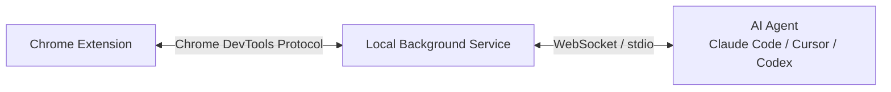

当 OpenAI Operator 和 Anthropic Computer Use 把浏览器自动化搬到云端时，月之暗面选择了一条相反的路：让 AI Agent 直接操作你本地 Chrome 窗口里的真实网页。

这条路径的核心差异不是「谁能点按钮」，而是**数据主权归谁**。

## 为什么云端方案不够

现有的 AI 浏览器自动化工具大致分两类：

一类是云端托管浏览器，比如 OpenAI Operator、Perplexity Comet。Agent 在服务商的服务器上运行一个无头浏览器，你通过自然语言发指令。问题是：你的登录态、Cookie、页面内容全部流经第三方基础设施。

另一类是桌面级自动化，比如 Anthropic Computer Use。它在你的机器上运行，但通常需要独立的虚拟桌面或容器环境，与日常使用的浏览器隔离。

对于企业场景，这两类方案都有硬伤：

- **敏感数据外泄**：内部系统、银行页面、邮件内容不可能送到云端
- **登录态隔离**：云端浏览器没有你的企业 SSO 登录态，遇到需要身份验证的页面直接卡住
- **上下文断裂**：自动化浏览器和日常浏览器是两回事，用户需要来回切换

Kimi WebBridge 的解法很直接：**不新建浏览器，直接接管你已经在用的那个。**

## 架构拆解：本地优先意味着什么

WebBridge 由两部分组成：

**浏览器扩展**安装在现有 Chrome/Edge 中，拥有当前页面的完整访问权限——包括 Cookie、LocalStorage、登录态。

**本地后台服务**是一个独立进程，通过 Chrome DevTools Protocol（CDP）与扩展通信。CDP 是开发者调试浏览器时用的同一套底层接口，可以执行点击、输入、截图、DOM 查询等操作。

**Agent 连接**支持多种方式：Kimi Code CLI 原生集成；Claude Code、Cursor、Codex 通过一条连接命令接入。

关键设计：Moonshot 的服务器不参与任何页面内容传输。扩展和后台服务之间的通信完全在本地完成。

## 与 MCP 生态的关系

今年 Google 官方推出了 Chrome DevTools MCP Server，让 AI 编码助手能通过 MCP 协议调试网页。WebBridge 和它的关系值得理清：

| 维度 | Chrome DevTools MCP | Kimi WebBridge |
|------|---------------------|----------------|
| 定位 | 调试与性能分析工具 | 通用浏览器自动化 |
| 浏览器 | 需单独启动调试实例 | 直接复用现有窗口 |
| 登录态 | 无（干净环境） | 继承当前用户登录态 |
| 适用场景 | 开发调试、性能审计 | 数据采集、表单填写、跨站整合 |
| 协议 | MCP over stdio | 自定义协议 + CDP |

两者不是竞争关系，而是互补。开发阶段用 Chrome DevTools MCP 调试页面；生产自动化用 WebBridge 操作真实业务环境。

一个更实际的观察是：MCP 作为协议层正在标准化工具调用的接口，但具体「工具做什么」仍然由各实现决定。WebBridge 可以被视为一种特殊的「浏览器工具」，未来完全可能通过 MCP 暴露给更多 Agent。

## 能做什么，不能做什么

从现有信息看，WebBridge 支持的操作包括：

- 打开页面、点击元素、填写表单
- 滚动、截图、提取文本
- 跨站点内容整合
- 在已登录状态下操作（如后台管理、SaaS 平台）

典型场景举例：

> "从 LinkedIn 搜索 5 个符合条件的候选人，把姓名和职位整理成表格"

Agent 会打开 LinkedIn（已登录）、执行搜索、逐一点开个人页、提取信息、汇总输出。全程不需要你手动操作。

但限制也很明显：

- **依赖页面稳定性**：DOM 结构一变，选择器可能失效
- **无法处理复杂验证码**：图形验证码、reCAPTCHA 等仍需人工介入
- **长流程可靠性未知**：涉及 10+ 步骤的跨站操作，中间任一环节失败都会中断

## 工程视角的评估

### 安全模型

本地优先架构的安全优势是真实的：页面内容、Cookie、截图都不离开本机。但需要注意两个细节：

1. **Agent 本身仍然可能泄露数据**。如果连接的是云端模型（如 Claude API），页面提取的文本会被发送到模型服务商
2. **后台服务的权限边界**。CDP 的权限很高，能做的事不止「点击按钮」。需要确认本地服务是否有沙箱隔离

### 与 RPA 的区别

传统的 RPA（Robotic Process Automation）工具也能做浏览器自动化，但通常基于录制回放或固定脚本。WebBridge 的差异在于：

- **自然语言驱动**：用 prompt 描述目标，而非预定义步骤
- **视觉理解**：结合截图让模型判断页面状态
- **容错能力**：遇到意外弹窗或布局变化，模型可以尝试重新定位元素

### 性能考量

CDP 操作本身很快，但瓶颈在模型推理。每步操作（截图 → 发送模型 → 解析响应 → 执行点击）的延迟取决于模型服务商的响应时间。本地模型（如 Kimi K2.6）可以消除网络延迟，但硬件要求更高。

## 对国内团队的启示

WebBridge 的发布释放了一个明确信号：浏览器自动化正在从「云端托管」向「本地原生」分化。

对于需要操作内部系统的企业，本地方案几乎是唯一选择。几点直接可用的参考：

**第一，评估现有 RPA 工具的替代可能。** 如果团队已经在用 Selenium、Playwright 写固定脚本，可以尝试用 Agent 驱动同一套底层能力，把「写脚本」变成「写 prompt」。

**第二，关注 MCP 协议的浏览器工具链。** Chrome DevTools MCP、Playwright MCP 等正在形成标准接口，未来 Agent 切换浏览器后端的成本会降低。

**第三，安全策略需要重新设计。** 本地 Agent 操作浏览器意味着「人 + AI」共用同一套身份。传统的「按人授权」模型需要扩展为「按会话授权」，区分人工操作和 Agent 操作的行为边界。

## 总结与行动

Kimi WebBridge 的价值不在于技术突破，而在于它选择了一个被忽视的方向：**在数据主权和自动化能力之间，优先保证前者。**

三个关键判断：

1. **本地优先是刚需，不是偏好。** 涉及登录态和敏感数据的场景，云端方案天然不适用
2. **CDP 是事实标准。** Chrome DevTools Protocol 已经成为浏览器自动化的通用底层，围绕它的工具生态会继续扩大
3. **Agent + 浏览器的组合还在早期。** 可靠性和容错能力距离生产级要求有差距，适合辅助场景而非关键流程

如果你正在探索 AI Agent 的落地场景，可以从一个低风险任务开始：让 Agent 帮你整理周报数据、汇总竞品信息、或批量处理后台表单。用 WebBridge 或 Playwright MCP 都可以，重点不是工具，而是验证「自然语言驱动浏览器」在你的业务场景里是否可靠。

---

**参考来源：**

- [Kimi WebBridge 官方页面](https://www.kimi.com/features/webbridge)
- [Chrome Web Store - Kimi WebBridge](https://chromewebstore.google.com/detail/kimi-webbridge/fldmhceldgbpfpkbgopacenieobmligc)
- [Chrome DevTools MCP - Google Developers](https://developer.chrome.com/blog/chrome-devtools-mcp)
- [5 Best MCP Servers for Browser Automation - Webfuse](https://www.webfuse.com/blog/the-top-5-best-mcp-servers-for-ai-agent-browser-automation)
