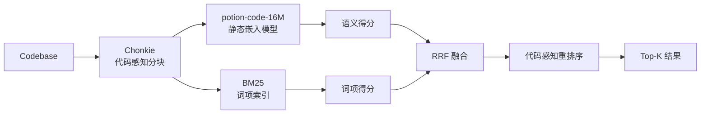

AI 编程 Agent 在大型代码库里找东西时，通常只有两招：grep 全文搜索，或者把整段代码塞进上下文让 LLM 自己看。

前者找得到字面匹配，但理解不了语义；后者准一点，但 token 消耗随代码量线性膨胀。一个中等规模的微服务仓库，几轮搜索下来就能烧掉几十万 token。

Semble 想解决的是同一个问题的第三个维度：**既要语义准确，又要 token 极简，还要本地毫秒级响应**。

## 为什么 grep + read 不是答案

Claude Code、Cursor 这类 Agent 的默认代码搜索链路大致是这样的：

1. 用 grep 或 ripgrep 按关键词扫一遍文件列表
2. 把匹配到的文件整块读进上下文
3. LLM 从中筛选出真正相关的片段

这个流程的问题不在 grep，而在「读整文件」。一个 500 行的模块文件，真正相关的可能只有 10 行，但剩下的 490 行照样占用 token 预算。按 Claude 的计费方式，这 490 行就是纯浪费。

更隐蔽的成本在交互轮次。Agent 第一次搜索没找到，会换关键词再搜；找到一部分后，又会顺着引用链继续读更多文件。几轮下来，token 消耗轻松破万。

Semble 的 benchmark 数据很直观：同样的检索任务，grep+read 平均消耗约 50 倍于 Semble 返回的 snippet 字符数。换算成 token，就是 **98% 的节省空间**。

## 核心设计：静态嵌入 + BM25 双路召回

Semble 的检索架构并不复杂，但每个组件的选择都指向同一个目标——**零外部依赖的极速本地搜索**。



**第一层：代码感知分块**

用 Chonkie 做初始切分，不是简单的按行数或字符数切，而是尊重代码的结构边界——函数、类、逻辑块。这样保证返回的 snippet 在语义上是完整的，Agent 拿到就能用，不需要再拼接上下文。

**第二层：双路召回**

- **语义路**：potion-code-16M，一个 1600 万参数的静态嵌入模型。静态的意思是查询时不需要 transformer 前向传播，直接查表取 embedding，所以能在 CPU 上跑到毫秒级。
- **词项路**：BM25，负责精确匹配标识符、API 名、类名。你搜 `save_pretrained`，BM25 能确保包含这个函数定义的文件排在前面。

两路结果用 RRF（Reciprocal Rank Fusion）融合，兼顾「意思相近」和「字面命中」。

**第三层：代码感知重排序**

融合后还有一组针对代码场景的微调信号：

- **定义提升**：包含 `class Foo` 或 `def bar` 的块，比单纯引用 `Foo` 的块排名更高
- **标识符词干**：搜 `parse config` 时，`parseConfig`、`ConfigParser`、`config_parser` 都会被加权
- **文件连贯性**：同一文件多个块命中时，整文件权重提升
- **噪声惩罚**：测试文件、compat shim、`.d.ts` stub 会被降权

整个流程在普通笔记本 CPU 上的耗时：索引一个平均规模的仓库约 250ms，单次查询约 1.5ms。

## 与 Transformer 方案的对比

Semble 的 NDCG@10 是 0.854，对比专门的代码 Transformer 模型（如 CodeRankEmbed），保留了约 99% 的检索质量。但速度和成本完全不在一个量级：

| 维度 | Semble | 代码 Transformer |
|------|--------|------------------|
| 索引速度 | ~250ms | ~50s（GPU）|
| 查询延迟 | ~1.5ms | ~15ms（GPU）|
| 硬件要求 | CPU 即可 | 需要 GPU 或 API |
| 外部依赖 | 无 | 模型服务/API Key |
| 检索质量 | NDCG@10 0.854 | 基准参照 |

这个 trade-off 的合理性取决于使用场景。如果你在做离线代码分析，50 秒索引一次完全可以接受；但如果 Agent 每轮对话都可能触发一次代码搜索，250ms vs 50 秒就是可用和不可用的区别。

## MCP 集成：一行命令接入 Agent

Semble 提供了原生的 MCP server，对接成本极低。

Claude Code 用户直接执行：

```bash
claude mcp add semble -s user -- uvx --from "semble[mcp]" semble
```

Cursor 用户在 `~/.cursor/mcp.json` 里加一段配置：

```json
{
  "mcpServers": {
    "semble": {
      "command": "uvx",
      "args": ["--from", "semble[mcp]", "semble"]
    }
  }
}
```

Codex、OpenCode 同理，都是一行配置的事。

MCP 暴露两个工具：

- `search`：用自然语言或代码片段搜索仓库，支持本地路径或 git URL
- `find_related`：给定文件路径和行号，返回语义相似的代码块

远程仓库会被自动克隆并缓存索引，本地路径则会被监控文件变更、实时重建索引。

## 实战：在真实项目里省了多少 token

Semble 内置了 token 节省统计，执行 `semble savings` 可以看到累计数据：

```
Period        Calls   Savings
────────────────────────────────────────
Today         42      ~58.4k tokens (95%)
Last 7 days   287     ~312.4k tokens (90%)
All time      1.4k    ~1.2M tokens (89%)
```

计算方式很直接：`(file_chars - snippet_chars) / 4`，按平均每 token 4 字符估算。假设一个 Agent 每天执行 40 次代码搜索，一年下来能省掉约 2000 万 token。按当前主流模型的 API 价格，这是数千美元量级的成本差异。

但比钱更重要的是**上下文窗口的释放**。Agent 的上下文是有限的，省下来的 token 可以用来放更多相关代码、更长的对话历史，或者更复杂的推理链。

## 局限与适用边界

Semble 不是万能药，有几个场景它并不擅长：

**跨仓库语义关联**。它擅长在一个代码库内找相关实现，但如果你想问「这个项目和那个项目的设计模式有什么异同」，Semble 帮不上忙。

**动态代码生成**。对于模板元编程、宏展开后的代码，静态分块可能切不到最有意义的边界。

**超大规模单体仓库**。虽然索引速度是线性的，但千万行级别的仓库在消费级硬件上的首次索引时间可能达到秒级，不再是「无感知」的体验。

另外，potion-code-16M 是英语和主流编程语言优化的模型，对于以中文注释为主、或小众语言（如 Coq、Lean）占主导的仓库，语义路的效果会有折扣。

## 总结与行动

Semble 的价值不在于发明了新的检索算法，而在于**把正确的组件组合成了一个 Agent 原生的工作流**。

- 静态嵌入砍掉了 GPU 依赖和 API 成本
- BM25 保证了标识符级别的精确召回
- 代码感知的重排序让结果更符合开发者的直觉
- MCP 封装让集成成本降到一行命令

如果你正在用 Claude Code 或 Cursor 处理大型代码库，可以按这个 checklist 验证效果：

1. 安装 Semble MCP：`claude mcp add semble -s user -- uvx --from "semble[mcp]" semble`
2. 在项目中执行一次语义搜索，对比默认 grep 的返回质量
3. 观察 Agent 后续对话的 token 消耗变化
4. 用 `semble savings` 跟踪一周累计数据
5. 对于高频搜索的仓库，把索引预热加到项目启动脚本里

Agent 时代的基础设施正在快速分层。Semble 属于「让 Agent 看得更少、看得更准」的那一层，而这类工具的普及，会直接决定大规模代码重构、遗留系统维护等复杂任务能否真正交给 AI 自动完成。