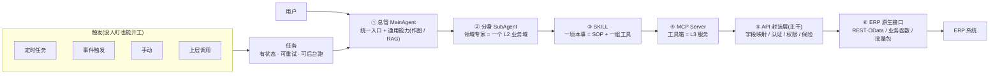
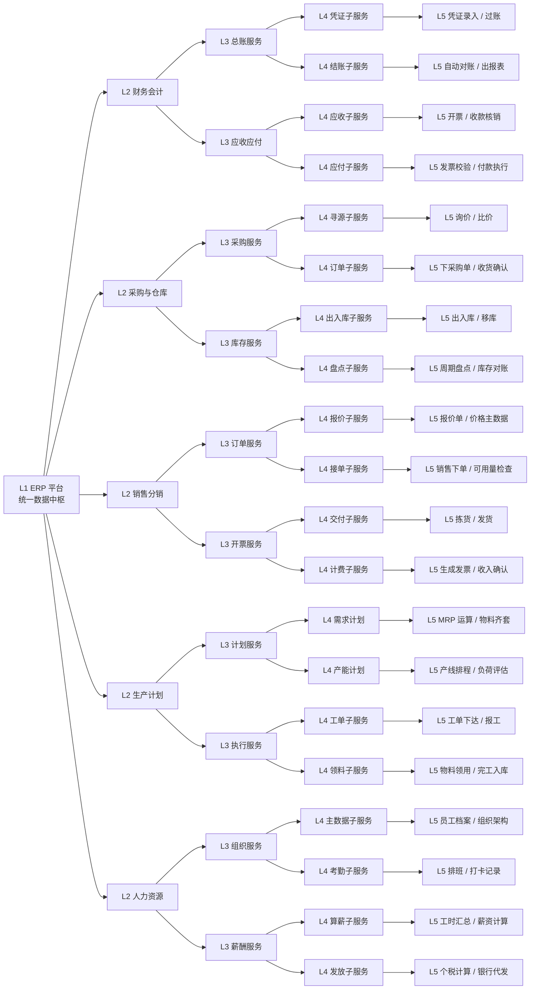
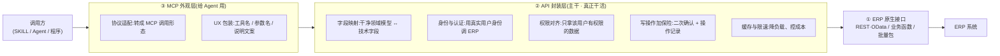
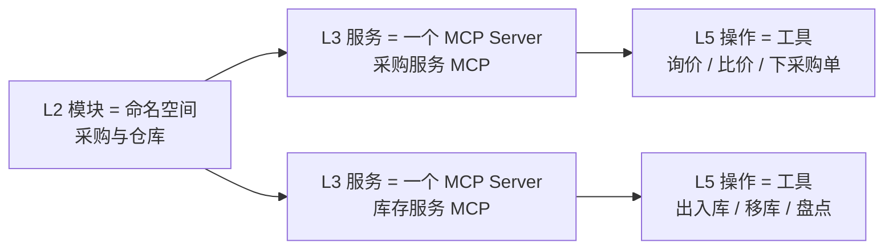
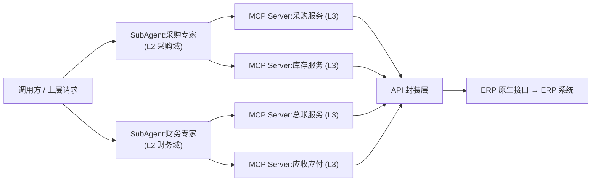
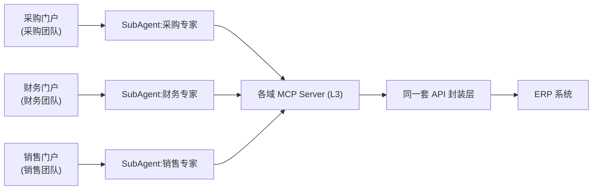
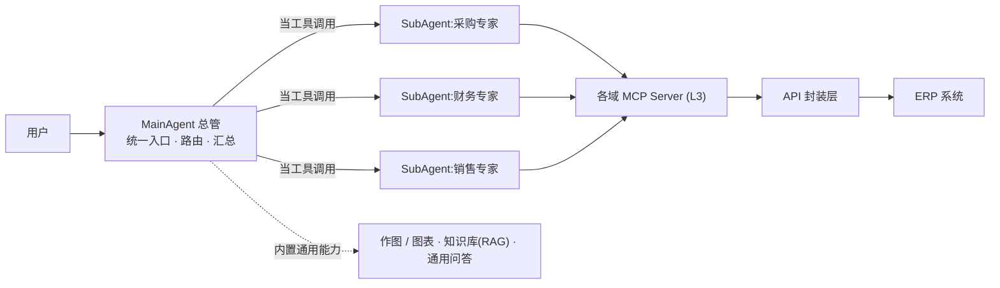

> **一句话结论**:要让 AI Agent 真正驱动一套复杂的 ERP,关键不是"让 Agent 直接调接口",而是**分层封装**——底层把接口收成一套干净 API(主干),往上逐层包成工具箱(MCP)→ 本事(SKILL)→ 领域专家(分身)→ 总管,再用触发器和任务让它没人盯着也能自己跑。
"要让外部的 AI Agent 跟 ERP 打交道,到底怎么接?"——这件事听起来很技术,但真正该想明白的,是**技术管理者和业务负责人**。这篇先把结论和全景图摆上来,再一层层拆开讲清楚。
## 一、结论先行:整套架构一张图
先看答案。下面这张图就是全部:一个请求进来后,沿着**能力栈**一层层走到 ERP;而旁边那排**触发器**,负责“没人点也能自动开工”。

两条线索读这张图:
- **能力栈(主干)**:用户 / 触发器 → 总管 → 分身(领域专家)→ SKILL(一项本事)→ MCP Server(工具箱)→ API 封装层(主干)→ ERP 原生接口 → ERP。每一层只做自己该做的事。
- **怎么被触发**:定时、事件、手动、上层调用,都先生成一个**任务**,再由任务驱动那条链。
**为什么非得分这么多层,而不让 Agent 直接调 ERP 接口?** 因为直连会同时踩三个坑:
1. **接口对人 / 模型都不友好**:字段名是 `A_PurchaseOrder` 这种技术代号,认证、权限还得自己处理。
2. **脏活要写很多遍**:认证、权限、字段映射如果每个调用方各写一遍,以后行为还容易不一致。
3. **工具一多就选不准**:几百个原生接口直接丢给模型,它根本挑不对该调哪个。
下面每一层,正是为逐个解决这些问题而存在。我们从最底下的主干往上搭。
## 二、能力地图:先把 ERP 切成 L1–L5
ERP 的本质,是把财务、采购、生产、销售、仓库、人事全部装进一套系统,**所有部门共用同一本账**。要封装它,先得知道它的能力是怎么分层的——这张分层图是后面一切切分的基准。

看懂这张图就抓住了两件事:一是 ERP 底下是**同一本账**,所以各部门的数字永远对得上;二是它的能力天然**分层**(L1 平台 → L2 模块 → L3 服务 → L4 子服务 → L5 操作),后面切 MCP、切分身,都对着这张图来。
## 三、主干:API 封装层(真正干活的一层)
ERP 默认就开放了一整排"服务窗口"(也就是 API),不同窗口用途不同:
<table header-row="true">
<tr>
<td>接口类型</td>
<td>大白话理解</td>
<td>干什么用</td>
</tr>
<tr>
<td>现代 REST / OData 接口</td>
<td>最现代的网络接口,还自带说明书</td>
<td>最主流。读写业务数据(查订单、查库存)</td>
</tr>
<tr>
<td>传统业务函数接口</td>
<td>ERP 老牌的"业务函数"(如 BAPI / RFC)</td>
<td>靠谱的写操作(创建订单、过账)</td>
</tr>
<tr>
<td>批量数据包</td>
<td>标准格式的批量数据交换(如 IDoc)</td>
<td>大批量、定时的数据同步</td>
</tr>
<tr>
<td>官方集成平台 / API 市场</td>
<td>ERP 厂商的"接口商店"和集成工具</td>
<td>现成的标准接口,拿来就能用</td>
</tr>
</table>
这些原生接口能用,但对人和模型都不友好。所以**主干是:先把这些接口封装成一套干净 API**(读优先 REST/OData,写补业务函数,批量同步用数据包),再在这套 API 之上套出**给 Agent 用的 MCP**——也就是下一节的工具箱。
> MCP 不是平行于 API 的另一套东西,而是**叠在 API 之上的一张"脸"**:它把同一套 API 能力,描述成 Agent 能看懂、能挑选的工具,底下调的还是同一套 API。(同理也能套出 CLI 等别的调用形态,它们一样只是 API 之上的薄壳——这点留到第五节讲。) {color="gray"}
为什么要这么叠?因为如果让每个调用方各自直连 ERP,认证、权限、字段映射这些脏活就得**写很多遍**,还容易行为不一致。沉到 API 层做一次,上面那层就能薄薄一层。

② 这层(主干)集中干五件事:
1. **字段映射**:把对外的"采购订单号"这类干净字段,翻译成 ERP 的 `A_PurchaseOrder` 技术代号。(给工具起易懂名字是上层的事,这层只管字段到 ERP 的映射。)
2. **身份与认证**:用"这个人本人"的身份去问 ERP,而不是一个万能超级账号。
3. **权限对齐**:拿到的数据必须限在该用户本来就有权限看的范围内。
4. **写操作加保险**:查询随便调;过账、改单据这种,必须加人工确认和操作记录。
5. **缓存与限速**:高频重复查询加缓存,既减轻 ERP 负担,也控住成本。
## 四、工具箱:MCP Server(按 L3 切,L5 做工具)
API 是主干,MCP 是外观层。接下来的问题是:这层外观该怎么切成一个个 MCP Server,每个 Server 里又放哪些工具?结论是——**对着第二节那张 L 分级图来切**。
### 封什么:按"想干的事",不按接口
最容易踩的坑,是拿原生接口 1:1 镜像成工具——一个模块底下几十上百个接口,真这么封会直接失控。正确做法是**按调用方"想干的事"来封**:优先高频读(查订单、查库存、查交付),再补少量受控写(创建采购申请、过账),并按业务域分组。
### 怎么切:Server 定在 L3,工具定在 L5
<table header-row="true">
<tr>
<td>L 级</td>
<td>是什么</td>
<td>在 MCP 体系里的角色</td>
</tr>
<tr>
<td>L1 ERP 平台</td>
<td>整个系统</td>
<td>整个"套件"的边界,不对应单个 Server</td>
</tr>
<tr>
<td>L2 模块</td>
<td>财务 / 采购 / 销售…</td>
<td>命名空间 / 产品线——太粗,不直接做成一个 Server</td>
</tr>
<tr>
<td>L3 服务 ✅</td>
<td>总账 / 库存 / 订单…</td>
<td>一个 MCP Server</td>
</tr>
<tr>
<td>L4 子服务</td>
<td>凭证子服务 / 出入库子服务…</td>
<td>Server 内部的工具分组(命名前缀)</td>
</tr>
<tr>
<td>L5 叶子操作 ✅</td>
<td>凭证录入 / 过账 / 询价…</td>
<td>一个工具(任务级)</td>
</tr>
</table>
为什么卡在 L3:**L2 太粗**(一个模块几十上百个操作,一个 Server 直接破上限);**L3 刚好**(一块内聚能力,收进它的 L5 操作约 10-40 个工具,还能独立开发、独立挂载);**L4 太细**(每个 Server 就两三个工具,Server 满天飞);**L5 就是工具**(任务级、名字自解释,模型一看就会用)。

按这张图拆出来约 10 个 Server:
<table header-row="true">
<tr>
<td>L2 模块(命名空间)</td>
<td>L3 → MCP Server</td>
<td>Server 内的工具(L5,示例)</td>
</tr>
<tr>
<td>财务会计</td>
<td>总账服务 MCP / 应收应付 MCP</td>
<td>凭证录入、过账、自动对账 / 开票、收款核销、付款执行</td>
</tr>
<tr>
<td>采购与仓库</td>
<td>采购服务 MCP / 库存服务 MCP</td>
<td>询价、比价、下采购单、收货确认 / 出入库、移库、盘点</td>
</tr>
<tr>
<td>销售分销</td>
<td>订单服务 MCP / 开票服务 MCP</td>
<td>报价、销售下单、可用量检查 / 拣货发货、生成发票</td>
</tr>
<tr>
<td>生产计划</td>
<td>计划服务 MCP / 执行服务 MCP</td>
<td>MRP 运算、产线排程 / 工单下达、报工、完工入库</td>
</tr>
<tr>
<td>人力资源</td>
<td>组织服务 MCP / 薪酬服务 MCP</td>
<td>员工档案、排班打卡 / 工时汇总、算薪、银行代发</td>
</tr>
</table>
### 数量这把尺子
- 单个 Server 的工具数控制在 **10-40**:常用 10-20,40 是上限而非目标。
- 卡住数量的不是上下文长度,而是**模型"选对工具"的准确率**——工具越多、越相似,越容易选错,再大的上下文窗口也救不了。
- 微调规则:某个 L3 太小(\<10 个工具)就和兄弟服务合并、退到 L2 级别;某个 L3 太大(\>40)就沿它的 L4 再拆成两个 Server。
- L2 模块当**命名空间**(如 `采购.下采购单`),避免跨服务撞名;要"采购全家桶",就同时挂 `采购服务` + `库存服务` 两个 Server,而不是做一个巨型 Server。
## 五、本事:SKILL(SOP + 一组工具)
MCP Server 是"一箱工具",但工具箱只回答"有哪些工具、怎么调"。真正把一件事干成,还需要**判断**和**步骤**——这就是 SKILL。
- **SKILL = 一项"会做的本事"**:不是裸工具,而是"这件事的 SOP / 判断 + 完成它要调的那组工具"打包在一起。比如"会过账"= 知道什么时候过、过之前查什么、调哪几个工具、出错怎么回滚。
> MCP Server 是"一箱工具",SKILL 是"一项本事":前者管"有哪些工具",后者管"怎么用其中几个工具、带着判断把一件事干成"。 {color="gray"}
注意 SKILL 和 MCP Server 看着"错位"是对的:一个管**能力**,一个管**工具存放**,互补而非替代。
<table header-row="true">
<tr>
<td>层级</td>
<td>角色</td>
<td>说明</td>
</tr>
<tr>
<td>L4 子服务</td>
<td>SKILL = 一项本事(SOP + 一组工具)</td>
<td>被分身装载、组合</td>
</tr>
<tr>
<td>L3 服务</td>
<td>MCP Server(工具箱)</td>
<td>工具实际存放处,被 SKILL 取用</td>
</tr>
<tr>
<td>L5 操作</td>
<td>工具</td>
<td>被 SKILL 在 SOP 里挑选调用</td>
</tr>
</table>
一个具体例子——"采购与仓库"这个域,身上装着几项 SKILL:
<table header-row="true">
<tr>
<td>SKILL(本事)</td>
<td>内置 SOP(判断)</td>
<td>取用的工具(来自哪个工具箱)</td>
</tr>
<tr>
<td>会寻源</td>
<td>先查历史合格供应商 → 询价 → 比价出推荐</td>
<td>询价、比价(采购服务 MCP)</td>
</tr>
<tr>
<td>会下单</td>
<td>先做可用量检查 → 下采购单 → 收货确认</td>
<td>下采购单、收货确认(采购服务 MCP)</td>
</tr>
<tr>
<td>会盘点对账</td>
<td>周期盘点 → 差异自动对账</td>
<td>出入库、盘点(库存服务 MCP)</td>
</tr>
</table>
可以看到:**一项 SKILL 可以横跨本域多个工具箱**(采购 + 库存),但每项自己是内聚的一件本事。把"SOP + 该调哪些工具"抽成独立 SKILL,有两个直接红利:**可复用**("会过账"能同时装到财务分身和成本会计分身,SOP 只写一次)、**可拼装**(定义新员工 = 勾选他该会的几项 SKILL)。
而且 SKILL 里的"一组工具"**不限于 MCP**——CLI 命令、现成脚本同样能被一项 SKILL 取用。因为 CLI 和 MCP 一样,都只是叠在同一套 API 之上的薄壳,底下调的是同一套能力,所以对 SKILL 来说,调一个 MCP 工具和敲一条 CLI 命令都只是"一个可调用的动作"。这有个现实好处:**已经做成 CLI 的运维能力**(批量导数、定时脚本、一行就能跑的老命令),不必先重新包成 MCP,就能直接被 SKILL 编排进 SOP——一项 SKILL 完全可以"几个 MCP 工具 + 一条 CLI 命令"混着用。
## 六、专家:SubAgent 分身(数字员工)
真实业务里,一件事常跨好几个 Server——比如"这批料收货后顺手过账",就同时碰到**库存服务**和**总账服务**。如果让调用方自己记住"挂哪几个 Server、按什么顺序调",负担又绕回来了。**SubAgent(分身)就是来扛这件事的**:把"一个领域该挂的 Server + 该懂的业务常识"打包成一个专家。
> MCP Server 是"会一件事的工具箱",SubAgent 是"懂一整个领域、知道什么时候该开哪个工具箱的人"。 {color="gray"}
- **对应一个 L2 域**:一个 SubAgent 就是一个业务域的专属 Agent(采购专家、财务专家…),装载本域全部 SKILL。
- **内置领域常识**:默认流程、字段口径、常见话术写进它的指令,所以它是"专家",而不只是工具转发器。

为什么要多这一层(而不让调用方直接挂一堆 Server):
1. **选得更准**:把可选范围收窄到"一个域",模型在更小、更不易混淆的工具集里挑,准确率自然更高。
2. **会编排**:跨 Server 的多步任务(下单 → 收货 → 过账)由域专家按 SOP 在内部串起来,调用方不用关心中间步骤。
3. **边界清晰**:一个域一个专家,权限、审计、回滚的边界天然对齐到业务域。
4. **可组合**:调用方只需"点名某个领域专家",底下挂几个 Server 它不用知道。
切分身的尺子:**一个 SubAgent = 一个 L2 域**,挂 2-5 个 L3 Server;域太大就再拆("采购与仓库"可拆成采购专家 + 库存专家);别做"万能 ERP 专家"把所有 Server 一股脑挂上。
还有一层好处——每个分身都能**单独当"领域门户"**:采购团队把采购专家挂到采购门户、财务团队把财务专家接到财务门户,各域独立上线、独立运营、独立迭代,谁也不用等谁。

> 上面三个门户可以**独立上线、独立迭代**,但底下合用同一套 API → ERP——门户各走各的,账还是同一本。 {color="gray"}
## 七、总管:MainAgent(把分身当工具 + 补通用能力)
用户往往不想记"这事该找采购专家还是财务专家",而且有些活儿(作图、查知识库)压根不属于任何业务域。**MainAgent 就是站在最上面、直接跟用户对话的总管**,它干两件事。
### 一、把每个 SubAgent 当成一个"高层工具"来调
MainAgent 不直接碰底层几百个 MCP 工具,而是把**每个 SubAgent 看作一个工具**:给它一句业务诉求("帮这批料收货并过账"),分身自己在域内决定调哪些工具、按什么顺序跑。
- **统一入口**:用户只跟 MainAgent 说话,该找哪个专家由它路由。
- **跨域协同**:一件事横跨采购 + 财务,MainAgent 拆开分派,再汇总结果。
- **再一次收窄选择面**:它面对的是十来个"领域专家",而不是几百个底层工具——层层收窄,选得才准。
### 二、自己握住一批"通用能力"
有些能力横跨所有域、又不依赖 ERP,放进任何一个分身都别扭,于是直接挂在 MainAgent 上,所有域共用:
- **作图 / 出图**:把查回来的数据画成图表、示意图。
- **知识库(RAG)**:查制度、查 SOP、查历史结论。
- 还可以有通用问答、网页检索等。
> 一句话分工:**领域里的事,MainAgent 全权委托给分身;跨域又通用的事,MainAgent 自己拿着。** {color="gray"}

## 八、让它自己跑:触发器 + 任务
前面整条链,调用方都是**人**。这一节加的东西**和上面的 L 阶梯垂直**:它不回答"谁能干什么",而回答"活儿什么时候跑、怎么跑",目的是让活儿**没人盯着也能自己跑起来**。
两个词,分工不同:
- **任务(Task)= 一件要干的活**:指明"让哪个分身、跑哪个 SKILL、输入是什么",自带状态(排队 / 跑着 / 成功 / 失败),能查进度、能重试。**长任务也归它管**——月结要跑两小时,它得能后台慢慢跑、断了能续。
- **定时任务(CronJob)= 一种触发器**:本身不干活,只负责"到点了,生成一个任务扯出去跑"。
> SKILL 是"会做",任务是"正在做的一件活",定时任务是"到点自动开工的闹钟"。 {color="gray"}
定时任务只是触发器的一种,和它并列的还有:
<table header-row="true">
<tr>
<td>触发器</td>
<td>大白话</td>
<td>例子</td>
</tr>
<tr>
<td>定时任务(CronJob)</td>
<td>到点自动开工的闹钟</td>
<td>每天 23:00 跑当日对账</td>
</tr>
<tr>
<td>事件触发</td>
<td>某件事一发生就开工</td>
<td>ERP 来了新发票 → 自动生成"校验入账"任务</td>
</tr>
<tr>
<td>手动触发</td>
<td>人点一下"现在就跑"</td>
<td>运营临时补一次同步</td>
</tr>
<tr>
<td>上层调用</td>
<td>被 MainAgent / 别的分身派活</td>
<td>"帮这批料收货并过账"</td>
</tr>
</table>
它们的共同点:**都生成一个任务,再由任务去调起某个 SKILL / 分身**。

至此整套体系有了两个维度:**一条是“谁能干什么”(能力栈:工具 → SKILL → 分身 → 总管),另一条是“活儿怎么被触发、怎么跑完”(触发器 → 任务)**。前者决定能力边界,后者决定它能不能脱离人、自动运转——这正是这套体系能越长越大却不失控的原因。
<empty-block/>